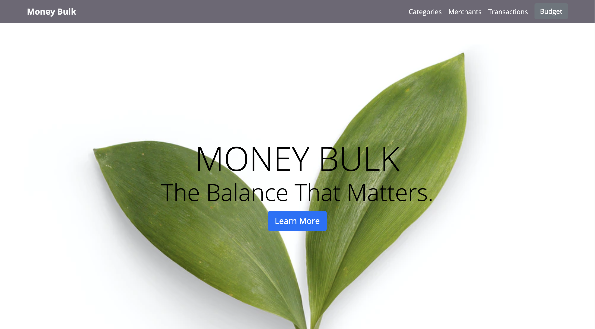

# Money Bulk
> Web application where the user can manage expenses to individual categories, then assign expenditure to one of those categories and display all transactions.
> Live demo [_here_](https://money-bulk.herokuapp.com/).

## Table of Contents
* [General Info](#general-information)
* [Technologies Used](#technologies-used)
* [Lessons Learned](#Lessons-learned)
* [MVP](#MVP)
* [Screenshots](#screenshots)
* [Setup](#setup)
* [Project Status](#project-status)
* [Acknowledgements](#acknowledgements)
* [Contact](#contact)


## General Information
- This project was over one week where I built this app to consolidate and expand on everything I had learnt
- MVC Design
- CRUD Functionality
- RESTful routes
- Filter transactions by category and merchant name


## Technologies Used
- [Ruby](https://www.ruby-lang.org/en/) - version 2.6.0
- [Sinatra](http://sinatrarb.com/) - version 2.1.0
- [PostgreSQL](https://www.postgresql.org/) - version 13.2
- [Bootstrap](https://getbootstrap.com/) - version 3.4.1


## Lessons Learned
- Object oriented programming with Ruby  
- Web Programming ( Sinatra, REST, MVC )
- Interacting with PostgreSQL database ( CRUD )
- Working under short time constraints and dealing with unknowns


## MVP
- The app should allow the user to create and edit merchants, e.g. Tesco, Amazon, ScotRail
- The app should allow the user to create and edit tags for their spending, e.g. groceries, entertainment, transport
- The user should be able to assign tags and merchants to a transaction, as well as an amount spent on each transaction.
- The app should display all the transactions a user has made in a single view, with each transaction's amount, merchant and tag, and a total for all transactions.


## Screenshots



## Setup
Install required modules, create and seed database (You must have Ruby, Sinatra, and PSQL installed).
```
ruby
bundle install
createdb spending_tracker
psql -d spending_tracker -f db/spending_tracker.sql
ruby db/seeds.rb
```
```
ruby app.rb
```
Host the app locally using Sinatra, defaults to port http://localhost:4567/


## Project Status
Project is: _complete_


## Acknowledgements

- This project inspired by [monzo](https://monzo.com/) and [Money Dashboard](https://www.moneydashboard.com/)

## Contact
Created by [drewpeattie@hotmail.com](mailto:drewpeattie@hotmail.com) - feel free to contact me!

